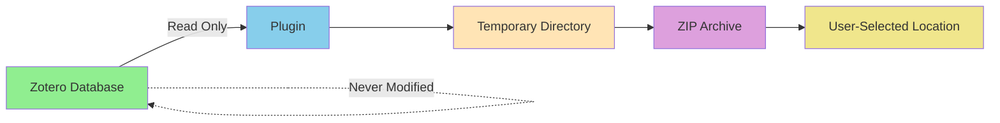

# Reversibility Principles

**Project**: Zotero Voyant Export
**Principle**: Every operation can be undone
**Philosophy**: Safe experimentation through reversible actions

## Overview

**Reversibility** is a core design principle: users should be able to undo, reverse, or recover from any action. This document describes how reversibility is implemented in Zotero Voyant Export and provides guidelines for contributors to maintain this principle.

## Core Principles

### 1. **No Destructive Defaults**

✅ **What We Do**:
- Exports create new files; never modify Zotero database
- Temporary directories cleaned up by OS (not deleted immediately)
- ZIP archives preserve all metadata
- Original attachments untouched

❌ **What We Avoid**:
- Deleting or modifying source files
- Irreversible database operations
- Silent data transformations
- Permanent file moves

### 2. **Confirmation for Risky Operations**

Currently, the plugin has no risky operations, but future development should:

```javascript
// ✅ GOOD: Confirm before potentially destructive action
const confirmed = confirm("This will overwrite existing export. Continue?");
if (!confirmed) return;

// ❌ BAD: No confirmation for risky action
deleteExistingExport(path);
```

### 3. **Git History Preservation**

All source code changes are reversible through Git:

```bash
# View history
git log --oneline

# Undo last commit (keep changes)
git reset --soft HEAD~1

# Undo last commit (discard changes)
git reset --hard HEAD~1

# Revert specific commit (creates new commit)
git revert <commit-hash>

# Restore specific file from history
git checkout <commit-hash> -- path/to/file
```

### 4. **Safe Experimentation**

The plugin supports safe experimentation through:

- **Non-destructive exports**: Creates new files, never modifies originals
- **Temporary directories**: Safe sandbox for processing
- **Explicit save locations**: User chooses where exports go
- **No auto-save**: User must explicitly select location

## Reversibility in Practice

### Export Process

```
User Action → Temporary Processing → User-Selected Output → Original Data Unchanged
```

**Reversible Operations**:

| Operation | How to Reverse |
|-----------|----------------|
| Export collection | Delete generated ZIP file |
| Install plugin | Uninstall via Tools → Add-ons |
| Update plugin | Reinstall previous version |
| Change settings | Reset to defaults (future feature) |

**Irreversible Operations**: None

### Data Flow



**Key**: Green = Source (never modified), Blue = Processing, Yellow/Purple = Output

### File Safety Guarantees

| File Type | Read/Write | Modification Risk | Reversibility |
|-----------|------------|-------------------|---------------|
| Zotero database | Read-only | None | N/A (never touched) |
| Zotero attachments | Read-only | None | N/A (never touched) |
| Temporary files | Read/write | OS cleanup | Automatic |
| Export ZIP | Write-only | User deletion | Manual |

## Development Guidelines

### For Contributors

When adding new features, maintain reversibility:

#### ✅ DO:

```javascript
// Create new files, don't modify existing ones
const exportPath = userSelectedPath;
Zotero.File.putContents(exportPath, content);

// Use temporary directories for processing
const tempDir = OS.Path.join(OS.Constants.Path.tmpDir, 'zotero-export');
OS.File.makeDir(tempDir);

// Provide undo/cancel mechanisms
const cancel = showCancelDialog();
if (cancel) {
  cleanupTempFiles();
  return;
}

// Log all operations for debugging
logger.info(`Creating export at: ${exportPath}`);
```

#### ❌ DON'T:

```javascript
// DON'T modify Zotero database
Zotero.DB.query("DELETE FROM items WHERE ...");  // ❌ Dangerous!

// DON'T delete user files without confirmation
OS.File.remove(userFile);  // ❌ Irreversible!

// DON'T modify attachments
attachment.setFile(newPath);  // ❌ Destructive!

// DON'T auto-save without user consent
saveToDefaultLocation();  // ❌ Unexpected behavior!
```

### Code Review Checklist

Before approving PRs, verify:

- [ ] No modifications to Zotero database
- [ ] No modifications to attachment files
- [ ] User explicitly chooses export location
- [ ] Temporary files cleaned up (or OS handles cleanup)
- [ ] Risky operations have confirmation dialogs
- [ ] All operations logged for debugging
- [ ] Documentation updated if behavior changes

## Recovery Procedures

### User Recovery

**If export fails mid-process**:

1. Check Zotero debug output for errors
2. Delete partial ZIP file (if created)
3. Free up disk space if needed
4. Try again with smaller collection
5. Report bug with debug output

**If export produces unexpected results**:

1. Delete the exported ZIP file
2. Check collection contents in Zotero
3. Verify items have attachments
4. Re-export with debug logging enabled
5. Compare metadata in ZIP with Zotero

**If plugin causes issues**:

1. Disable plugin: Tools → Add-ons → Disable
2. Restart Zotero
3. Check if issue persists (likely not plugin-related)
4. Re-enable plugin or uninstall
5. Report bug with reproduction steps

### Developer Recovery

**If development breaks the plugin**:

```bash
# Revert to last working commit
git log --oneline  # Find working commit
git checkout <commit-hash>

# Or create a branch from working state
git checkout -b fix-attempt <working-commit>

# Or reset to main branch
git reset --hard origin/main
```

**If tests fail**:

```bash
# Revert specific file
git checkout HEAD~1 -- lib/exporter.js

# Run tests again
make test

# If still failing, check CI/CD
git log --grep="test" --oneline
```

## Future Enhancements

To further improve reversibility:

### Planned Features

- [ ] **Export history**: Track past exports with metadata
- [ ] **Undo last export**: One-click removal of last export
- [ ] **Export preview**: Show what will be exported before creating ZIP
- [ ] **Differential exports**: Export only new/changed items since last export
- [ ] **Export restore**: Re-import exported metadata back into Zotero

### Not Planned (Intentionally)

- ❌ Auto-deletion of exports (user controls file lifecycle)
- ❌ Silent overwrites (always confirm or fail)
- ❌ Background exports without user knowledge

## Testing Reversibility

### Manual Testing

1. **Export Test**:
   ```
   1. Export collection
   2. Verify ZIP created
   3. Delete ZIP
   4. Verify Zotero unchanged
   ```

2. **Failure Test**:
   ```
   1. Fill disk space
   2. Attempt export
   3. Export should fail gracefully
   4. Verify no partial/corrupted files
   5. Verify Zotero unchanged
   ```

3. **Cancellation Test**:
   ```
   1. Start export
   2. Close Zotero mid-export (risky!)
   3. Restart Zotero
   4. Verify Zotero database intact
   5. Cleanup any temp files manually if needed
   ```

### Automated Testing

```javascript
// Test: Export doesn't modify source data
exports["test export preserves source data"] = function(assert) {
  const itemBefore = item.serialize();
  exporter.doExport(collection, tmpPath);
  const itemAfter = item.serialize();

  assert.deepEqual(itemBefore, itemAfter,
    "Item unchanged after export");
};

// Test: Failed export cleans up
exports["test failed export cleanup"] = function(assert) {
  const invalidPath = "/dev/null/invalid";
  exporter.doExport(collection, invalidPath);

  // Verify no temp files left
  const tempFiles = listTempFiles();
  assert.equal(tempFiles.length, 0,
    "Temp files cleaned up after failure");
};
```

## Philosophical Context

Reversibility aligns with several broader principles:

### Solid Economics

> "If it exists, there's a reason" — Ada programming philosophy

In software:
- **Every file has a purpose**: Don't delete without reason
- **Every action has consequences**: Make them reversible
- **Users own their data**: Don't modify without permission

### RVC (Robot Vacuum Cleaner) Tidying

Git + reversibility = safe experimentation:

```bash
# Try something risky
git checkout -b experiment
# ... make changes ...

# It worked!
git checkout main
git merge experiment

# It didn't work
git checkout main
git branch -D experiment  # Cleanup
```

### Fail Secure

When operations fail, fail safely:

```javascript
// ✅ GOOD: Fail without side effects
try {
  createExport();
} catch (error) {
  cleanup();  // Undo partial work
  throw error;  // Report failure
}

// ❌ BAD: Fail in broken state
try {
  modifyDatabase();  // Partial modification
  createExport();     // Might fail
} catch (error) {
  // Database now inconsistent!
}
```

## See Also

- [CONTRIBUTING.md](CONTRIBUTING.md): Contribution guidelines
- [DEVELOPMENT.md](DEVELOPMENT.md): Architecture and development guide
- [SECURITY.md](SECURITY.md): Security principles (including "Fail Secure")
- [TPCF.md](TPCF.md): Governance and trust model

## License

This document is part of Zotero Voyant Export, licensed under triple license (GPL-3.0 / MIT / Palimpsest-0.8).

Choose your preferred license from [LICENSE.txt](LICENSE.txt).

---

**Last Updated**: 2025-11-28
**Version**: 1.0.0
**Contact**: cora@corajr.com

*"The ability to undo is the freedom to experiment."*
